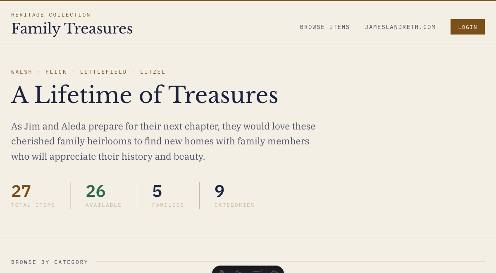
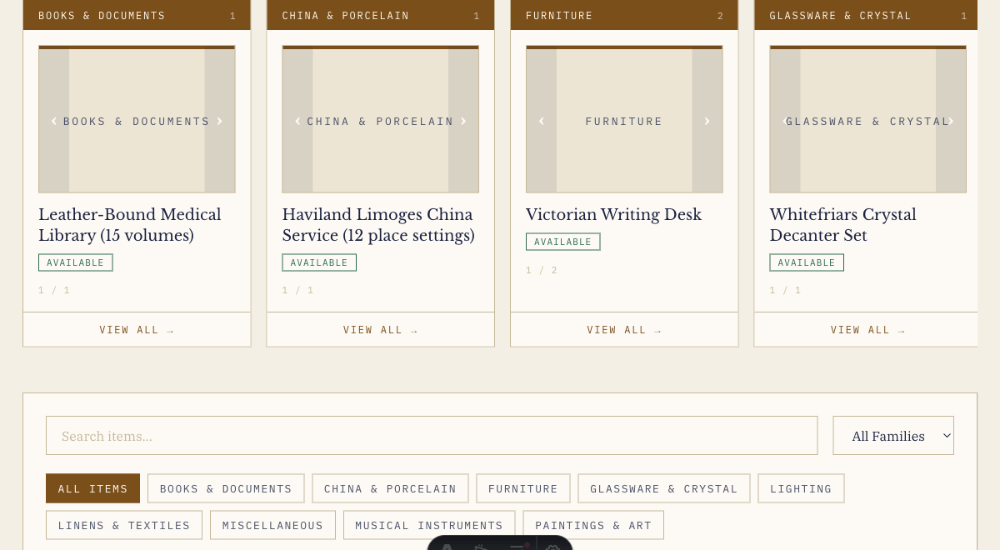

# Artifact Submission Guide for Aleda

Email subject: Family Treasures artifact details for the website

Hi Aleda,

Jim asked that we put together a clear guide you can use to send artifact information for the Family Treasures website. The goal is to make each item easy for family members to browse, understand, and claim.

For each artifact, please send the fields below. A simple numbered list in an email is fine. You can send one artifact at a time or group several artifacts in the same message.

## What to Send for Each Artifact

1. **Title**

   A short, specific name for the item.

   Example: `Victorian Writing Desk`

2. **Photos**

   Please include 1 to 3 clear photos per artifact.

   Helpful photo angles:

   - One full view of the item
   - One closer detail view
   - One photo of any maker's mark, label, signature, inscription, damage, or special feature

3. **Category**

   Choose the closest category from this list:

   - Books & Documents
   - China & Porcelain
   - Furniture
   - Glassware & Crystal
   - Jewelry & Accessories
   - Kitchenware
   - Lighting
   - Linens & Textiles
   - Musical Instruments
   - Paintings & Art
   - Tools & Equipment
   - Miscellaneous

4. **Family**

   Which family line or person the item is most closely connected to.

   Examples: `Walsh`, `Flick`, `Littlefield`, `Litzel`, `Jim and Aleda`, `unknown`

5. **Estimated Value**

   A rough estimate is enough. This does not need to be a formal appraisal.

   Examples: `$75 - $150`, `$200`, `unknown`, `sentimental value only`

6. **Status**

   Use one of these:

   - `available` - family members may claim it
   - `claimed` - someone in the family has already asked for it
   - `sold` - it is no longer available because it was sold

7. **Description**

   A short description of what the item is, what it looks like, and any useful details.

   Example: `Small oak writing desk with three drawers, brass pulls, and a fold-down writing surface. There are scratches on the top but the drawers still work.`

8. **Provenance & History**

   Any known story behind the item: who owned it, where it came from, when it entered the family, where it was kept, or why it matters.

   Example: `This desk belonged to Jim's father and was kept in the upstairs bedroom for many years. Jim remembers it being used for household papers and letters.`

## Copy-and-Paste Template

```text
Artifact 1

Title:
Photos: attached
Category:
Family:
Estimated Value:
Status:
Description:
Provenance & History:
```

Repeat that block for each item.

## Claiming Items

On the website, family members can open an artifact page and claim an available item. Once an item is claimed, the site will show that it has been claimed so other family members know it is no longer available.

If you already know an item has been claimed before it goes on the site, mark its status as `claimed` and include the person's name in the description or provenance notes.

## Current Site Design

These screenshots show how the information will appear on the Family Treasures site:





Each submitted artifact becomes a listing that family members can browse by category, filter by family, and open for more details.

Thanks,

Parker
